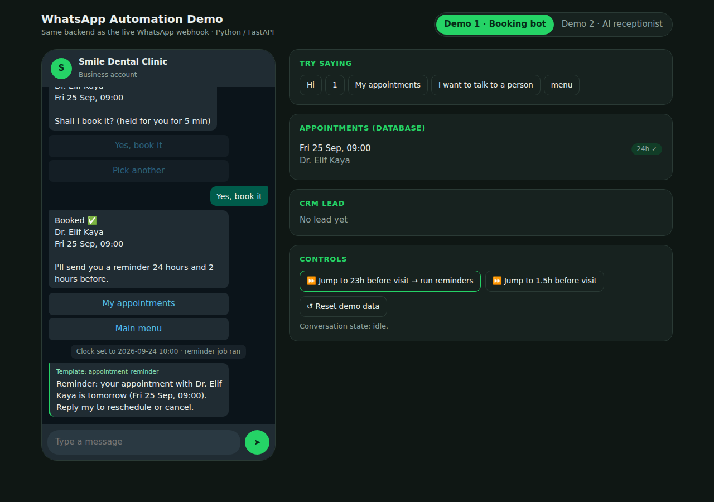
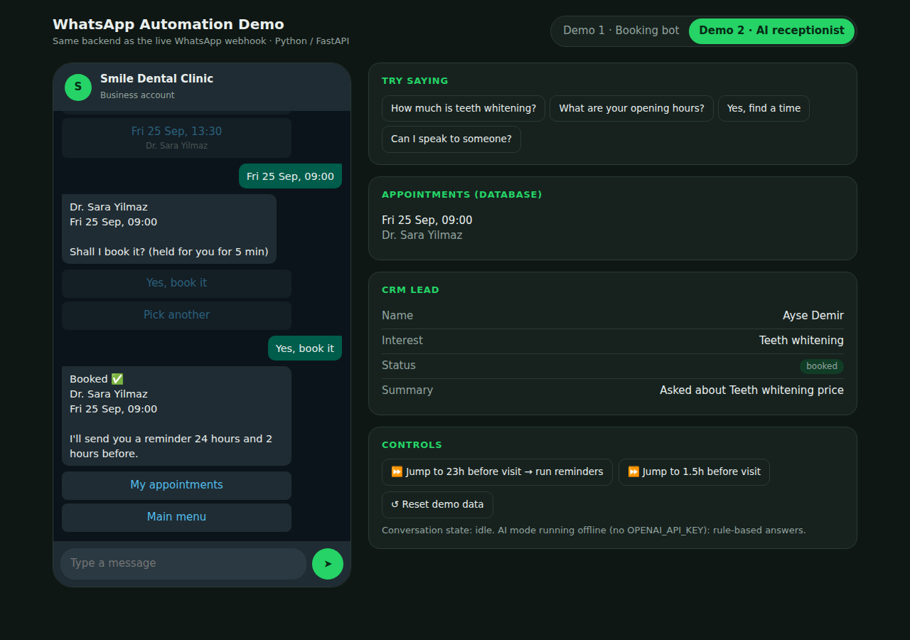
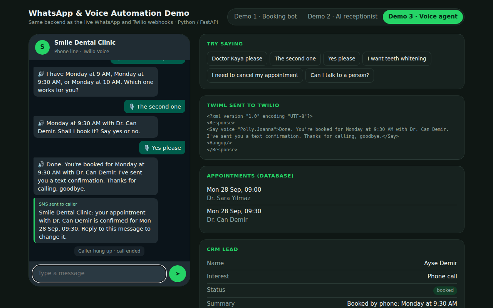

# WhatsApp & Voice Booking Automation (Python / FastAPI)


Three production-style assistants for clinics and other appointment businesses,
sharing one booking engine: two WhatsApp Business API bots and an AI voice
receptionist on the phone (Twilio). A browser simulator lets anyone try all
three without a Meta or Twilio account.

🎬 **1-minute walkthrough:** [docs/demo-walkthrough.mp4](docs/demo-walkthrough.mp4)

| Demo | What it shows |
|---|---|
| **1. Clinic booking bot** | Menu/button flow: pick doctor → pick time → confirm. Slot hold while the patient decides, **no double bookings** (DB unique constraint), cancel & reschedule in chat, **24h and 2h reminders** via approved templates, human handover. |
| **2. AI receptionist** | LLM agent (OpenAI tool calling) that answers from the clinic's real data, qualifies the lead one question at a time, books through the same booking engine, **syncs the lead to a CRM** and hands over to staff when needed. Runs in an offline rule-based mode when no API key is set. |
| **3. Voice agent (phone)** | Caller rings the clinic number; Twilio speech recognition + TwiML. The agent offers 3 free times, books through the same engine, **texts an SMS confirmation**, cancels existing appointments and **transfers to reception** when asked or when it can't understand twice. Twilio request signatures are verified. |





## Run it locally (2 minutes)

```bash
pip install -r requirements.txt
uvicorn app.main:app --reload
# open http://localhost:8000/demo
```

Use the **⏩ Jump to 23h before visit** button to see the reminder job fire.
Set `OPENAI_API_KEY` to switch Demo 2 from offline mode to the real AI agent.

## Connect a real WhatsApp number

1. Meta for Developers → create an app → add **WhatsApp** → note the *Phone number ID*.
2. Create a permanent System User token with `whatsapp_business_messaging`.
3. Copy `.env.example` to `.env` and fill `WA_*` values (set `WA_APP_SECRET` so
   every webhook call is signature-checked).
4. Deploy (Docker file included) and set the webhook URL to
   `https://your-domain/webhook` with your `WA_VERIFY_TOKEN`; subscribe to `messages`.
5. Create and get approved a utility template `appointment_reminder` with body
   params `{{1}}` name, `{{2}}` time, `{{3}}` doctor.

## Connect a real phone number (voice agent)

1. Buy a voice-capable number in Twilio.
2. Set `TWILIO_ACCOUNT_SID`, `TWILIO_AUTH_TOKEN`, `TWILIO_FROM_NUMBER`,
   `PUBLIC_BASE_URL` (used for signature checks) and optionally
   `CLINIC_TRANSFER_NUMBER` in `.env`.
3. In the number's settings, set *A call comes in* → Webhook →
   `https://your-domain/voice` (HTTP POST).

The same `/voice` logic can sit behind Vapi or Retell if you prefer their
voices; the booking engine and CRM sync stay the same.

## Architecture

```
WhatsApp ──► POST /webhook ──► signature check ──► 200 OK fast
                                   │ (background)
                                   ▼
                    idempotency (wamid table, Meta retries are ignored)
                                   ▼
               human handover? ── yes ──► bot stays silent
                                   │ no
                    BOT_MODE=booking │ BOT_MODE=ai
               booking_flow.py ◄────┴────► ai_agent.py (LLM + tools)
                        └────► scheduling.py ◄────┘      └─► crm.py (lead upsert + webhook)
                                   ▼
                       SQLite / PostgreSQL (slots, appointments, log)
                                   ▲
         reminder job (every 60s) ─┘ ──► template messages via Cloud API
```

Reliability details that usually break in WhatsApp projects:

- **Retries from Meta** → each `wamid` is processed once.
- **Double booking** → `UNIQUE(slot_id)` on appointments + short slot holds.
- **24-hour window** → reminders are template messages, not free text.
- **Buttons vs lists** → ≤3 short options become reply buttons, more become a list message.
- **Outbound failures** → retries on 5xx/network errors, errors are logged.
- **Handler crash** → the patient still gets a polite fallback message.

## Tests

```bash
pytest -q
```

24 tests: WhatsApp and Twilio signature validation, webhook parsing, idempotent
delivery, full booking flow, double-booking protection, slot holds,
reschedule/cancel, reminder timing, human handover, AI agent tool use with a fake
LLM client, offline mode, phone booking with SMS confirmation, phone cancel and
transfer, TwiML output.

## Project layout

```
app/
  main.py          FastAPI routes: webhook, admin, simulator API
  whatsapp.py      Cloud API payloads, signature check, parsing, senders
  service.py       inbound pipeline + reminder job
  booking_flow.py  Demo 1 state machine
  ai_agent.py      Demo 2 LLM agent + offline mode
  voice.py         Demo 3 phone agent: TwiML, Twilio signatures, SMS confirmation
  scheduling.py    slots, holds, booking, cancel
  crm.py           lead upsert + CRM webhook
  db.py, seed.py   models and demo data
  static/demo.html browser simulator
tests/
```

## Author

Built by **Mehmet Aydemir**, senior software engineer building WhatsApp, SMS and voice automation for clinics and service businesses. Available for projects on [Upwork](https://www.upwork.com/freelancers/~01a209c02b52213168).
